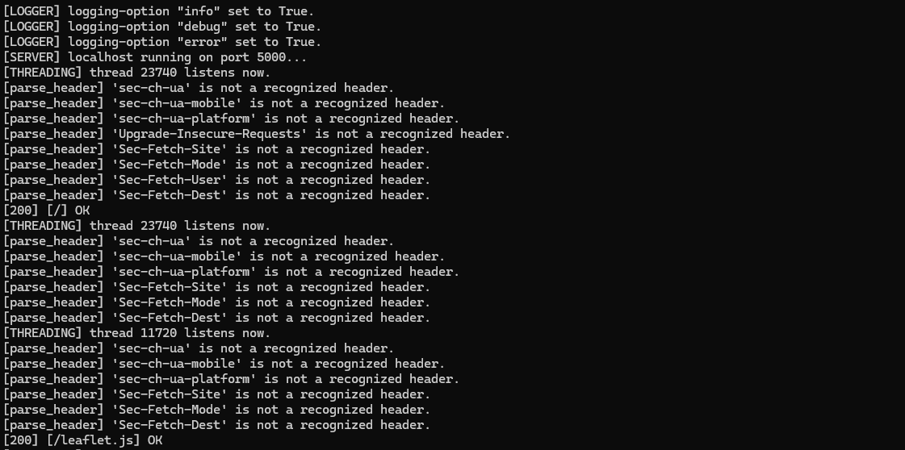

# bbwebservice

`bbwebservice` is a small python library to make simple webserver.

## installation

to install this library use the pip command: `pip install bbwebservice`

## usage

- import:

```py
from bbwebservice.webserver import * 
```

1. register pages for http `GET`
`@register`: when using the `@register` decorator you have to define the named parameters `route` and `type`
    `route`: the URL which has to be requested via http `GET` method for the decorated funktion to execute. The decorated function is expected to return the respective response content.
    `type` : the `type` parameter holds the intended MIME-type of the respose.


```py
@register(route='/', type= MIME_TYPE.HTML)
def main_page():
    return load_file('/content/index.html')
```

2. register pages for http `POST`
`@post_handler`: works analog to [1.], the only difference is that it is mandatory for the decorated function to take a parameter.

```py
@post_handler(route='/makethread', type=MIME_TYPE.HTML)
def makethread(args):
         return load_file('/content/post.html')
```


## server configuration:
In the directory `/config`, there is a file named `config.json`. Here can config

```json
{
    "ip": "localhost",
    "port": 5000,
    "queue_size": 10,
	"SSL": false,
	"cert_path" : "",
	"key_path" : ""
}
```

If you intend to keep the application centrally (online), it is recommended to set the value of `ip` to either `default` or the IP address of the respective server. Additionally, it is advisable to activate `SSL` and set the corresponding paths for `cert_path` and `key_path`. 

### Recommended Ports

- 5000: For testing purposes
- 443: For HTTP (SSL = false)
- 80: For HTTP (SSL = false)

## logging

```py
set_logging(LOGGING_OPTIONS.INFO,True)
set_logging(LOGGING_OPTIONS.DEBUG,True)
set_logging(LOGGING_OPTIONS.ERROR,True)
```

